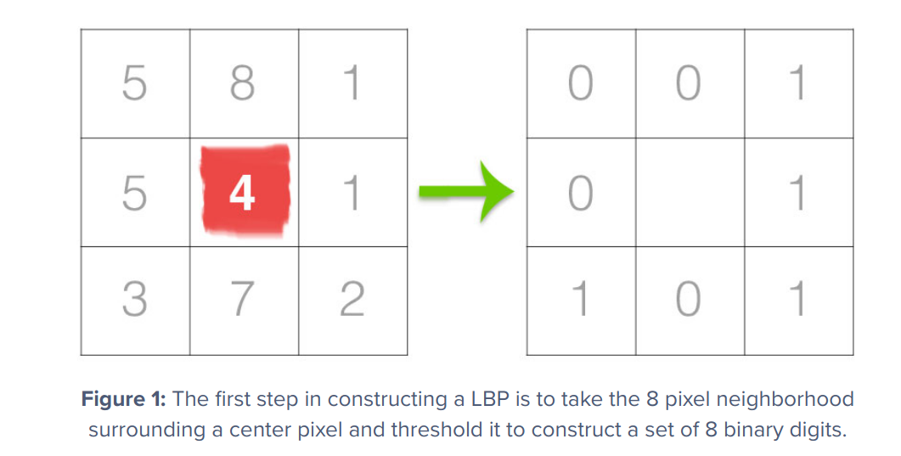
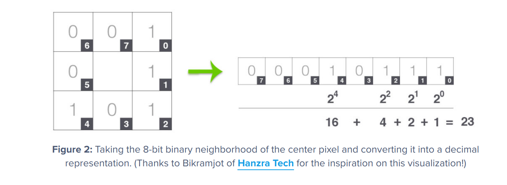
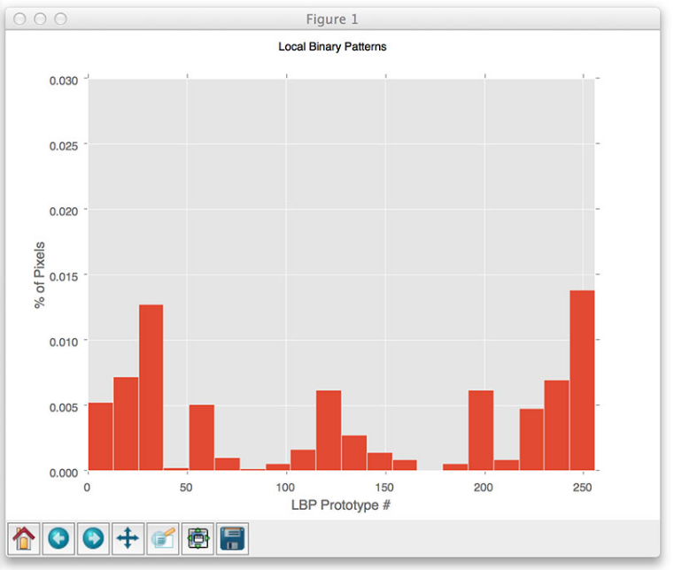
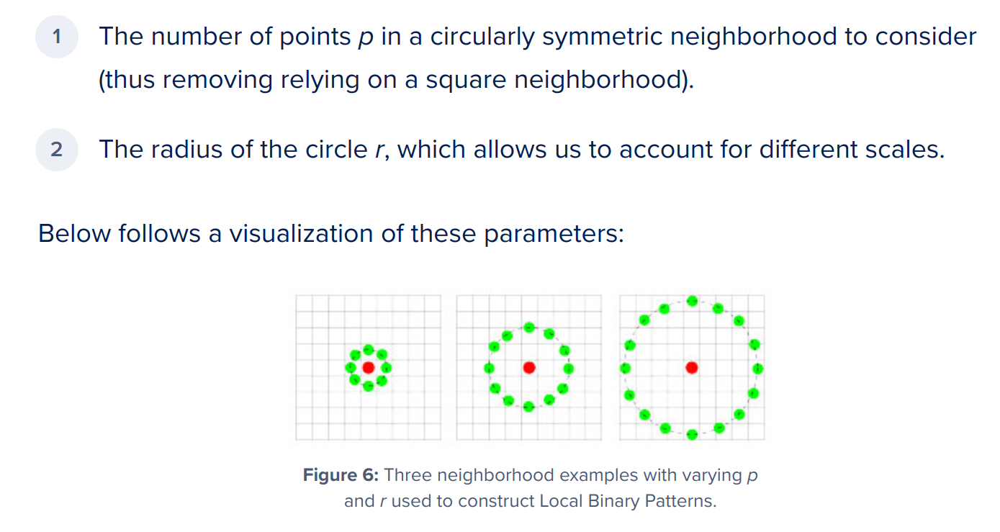

# Stereo matching for Challenging Obstacle Detection

## First attempt: 

### Traversable region detection using U-V disparity

http://www.ra.cs.uni-tuebingen.de/mitarb/lu/pdf/ccc2013.pdf

Steps:

The traversable regions can be modeled as a succession of planes, so they can be projected to be slanted line segments in the v-disparity image, i.e. ground correlation lines. As too much  noises  caused  by  the  non-traversable  regions  in  the  v-disparity image would make it difficult to detect the cor-rect  ground  correlation  lines,  they  should  be  removed  as  much as possible before generating the v-disparity image. We define obstacle disparity image as the regions in the disparity  image  corresponding  to  potential  obstacles.  The  
intensity of a pixel (u, d) in the u-disparity image refers to the number of pixels with the same disparity value d in the uth column of the disparity image. If the intensity is higher than  a  threshold,  it  means  that  in  a  certain  column  of  the  image, there are too many points which have the same dis-tance to the camera, and these points correspond to potential obstacles.  After  taking  this  into  consideration,  we  perform  the  following  steps  to  obtain  the  obstacle  disparity  image  which  contains  the  potential  non-traversable  regions  or  obstacle regions:

- Step 1  U-disparity is calculated by accumulating pixels with  the  same  disparity  d  in  each  column  of  the  disparity  image,  as  shown  in  Fig.  3(b)  followed  by  the  u-disparity  image  shown  using  a  pseudo  color  LUT  in  Fig.  3(d).  It  is  obvious that there are many line segments in the u-disparity image  corresponding  to  obstacles  and  the  obstacle  regions  should be removed from the original disparity image before calculating the v-disparity image. 

- Step 2  Binarized obstacle image is built. For every pixel (u, d) in the u-disparity image, if its intensity is greater than a threshold, then in the uth column of the disparity image, those pixels whose disparity equals to d are set to be obstacle pixels, and those pixels whose disparity does not equal to dare  set  to  be  potential  traversable  region  pixels.  Here  the  threshold  indicates  the  height  of  potential  obstacles  meas-ured in pixels. So the binarized obstacle image can be gen-erated, as shown in Fig. 4(a), where the white regions rep-resent  the  potential  obstacles,  and  the  black  regions  repre-sent the potential traversable regions. 

- Step 3  Morphological close operation is performed on the binarized  obstacle  image  to  link  small  spaces  between  po-tential obstacles, as shown in Fig. 4(b). Small isolated black regions  can  also  be  eliminated  directly  as  noises  and  changed  to  be  potential  obstacle  regions,  as  shown  in  Fig.  4(c).  This  is  reasonable  because  as  to  black  regions,  too  small an area indicates that it cannot be traversable and thus should be treated as potential obstacles.
  

- Step 4  Obstacle disparity image is built according to the binarized  obstacle  image.  For  every  pixel  of  the  binarized  obstacle image, corresponding pixel of the original disparity image is studied. If a pixel of the binarized obstacle image belongs  to  potential  obstacle  regions,  then  the  correspond-ing  pixel  with  the  same  position  in  the  original  disparity  image is retained. If a pixel of the binarized obstacle image belongs  to  potential  traversable  regions,  then  the  corre-sponding  pixel  with  the  same  position  in  the  original  dis-parity image is deleted. So the obstacle disparity image can be generated, as shown in Fig. 4(d) by using a pseudo color LUT. 

- Step 5  Non-obstacle disparity image can be generated by subtracting  the  original  disparity  image  with  the  obstacle  disparity  image,  as  shown  in  Fig.  4(e)  by  using  a  pseudo  color LUT. From Fig. 4(e), we see that most of the potential obstacle  regions  or  non-traversable  regions  have  been  re-moved from the disparity image.

# My Pipeline:

## Appearance based detection

Local Binary Patterns, or LBPs for short, are a texture descriptor made popular by the work of Ojala et al. in their 2002 paper, Multiresolution Grayscale and Rotation Invariant Texture Classification with Local Binary Patterns (although the concept of LBPs were introduced as early as 1993).

Unlike Haralick texture features that compute a global representation of texture based on the Gray Level Co-occurrence Matrix, LBPs instead compute a local representation of texture. This local representation is constructed by comparing each pixel with its surrounding neighborhood of pixels.

The first step in constructing the LBP texture descriptor is to convert the image to grayscale. For each pixel in the grayscale image, we select a neighborhood of size r surrounding the center pixel. A LBP value is then calculated for this center pixel and stored in the output 2D array with the same width and height as the input image.

For example, let’s take a look at the original LBP descriptor which operates on a fixed 3 x 3 neighborhood of pixels just like this:

With 8 surrounding pixels, we have a total of 2 ^ 8 = 256 possible combinations of LBP codes.

    

